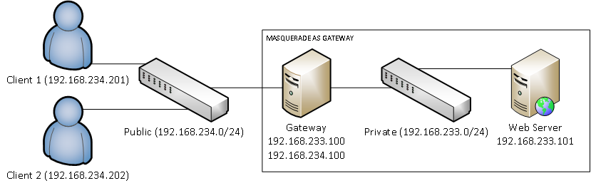
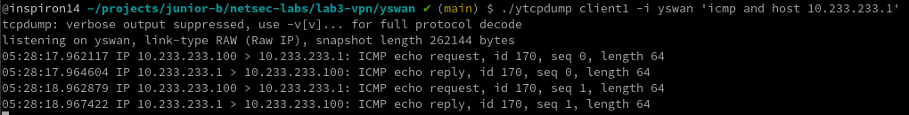
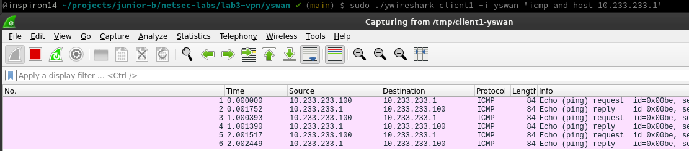

# yswan

Final Project for "Computer Networking Security": A Layer-3 VPN implementation over TLS

* Written in Rust with `tokio`

* Features
  - [ ] client authentication (PAM)
  - [ ] client authentication (cert)
  - [ ] multiple clients
  - [ ] centralized route installing

## Building

You can either use `cargo` directly to build:

```bash
cargo build
```

or run the custom build script (it will copy binaries to `./bin`)

```bash
./build
```

## Testing



"Gateway" is also serving as DNS on public networks to fake some domains (e.g., `gateway.example.net`).

```bash
# Enter gateway shell
docker-compose exec gateway bash
# Run yswan server
cd /app
./yswan server --tun-inet 10.233.233.1 --key ./pki/gateway/gateway.example.net.key --cert ./pki/gateway/gateway.example.net.pem --cacert ./pki/ca/ca.pem
```

```bash
# Enter client1 shell
docker-compose exec client1 bash
# Run yswan client
./yswan client --connect gateway.example.net --tun-inet 10.233.233.100 --cacert ./pki/ca/ca.pem --cert _ --key _
```

## Some utilities
* ypki: A small utility to make CA and endpoint certificates by OpenSSL.

  Example usage:
  ```bash
  # Make pki directory
  mkdir -p ./bin/pki
  
  # Generate certificates (+ keypairs) for CA
  mkdir ./pki/ca
  ./ypki ca --outputdir ./bin/pki/ca --cadir ./bin/pki/ca --subject example-ca --days 3650

  # Generate certificates (+ keypairs) for servers
  mkdir ./pki/gateway
  ./ypki endpoint --outputdir ./bin/pki/gateway --cadir ./bin/pki/ca --subject gateway.example.net --days 180
  ```

* ytcpdump: Wrapper for docker-compose + tcpdump

  Example usage:
  ```bash
  # Capture ICMP packets involving 10.233.233.1 at "yswan" interface on service "client1"
  ./ytcpdump client1 -i yswan 'icmp and host 10.233.233.1'
  ```

  

* ywireshark: Wireshark wrapper for docker-compose + tcpdump

  This is similar to `ytcpdump`.

  Example usage:
  ```bash
  # Capture ICMP packets involving 10.233.233.1 at "yswan" interface on service "client1"
  sudo ./ywireshark client1 -i yswan 'icmp and host 10.233.233.1'
  ```

  